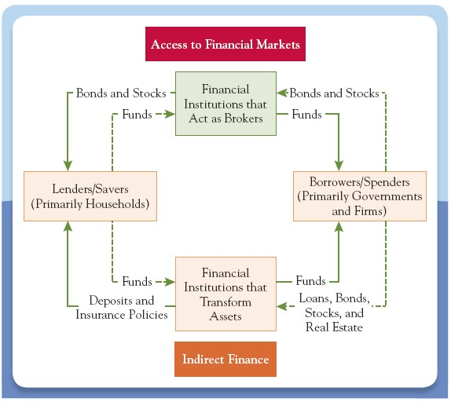

# Lecture 1: Introduction to Money and Financial System

**Instructor:** Fei Tan

 @econdojo &nbsp;&nbsp;&nbsp;&nbsp;  @BusinessSchool101 &nbsp;&nbsp;&nbsp;&nbsp;  Saint Louis University

**Course:** Monetary Economics
**Date:** December 28, 2025

---

## Six Parts of the Financial System

**1. Money** - Asset accepted as payment. Means of payment, unit of account, store of value. M1 (currency, checking) vs. M2 (M1 + savings, deposits).

**2. Financial instruments** - Legal obligations to transfer value (stocks, bonds, derivatives). Standardized and communicate information.

**3. Financial markets** - Buy/sell instruments. Provide liquidity, information, risk sharing. Primary (new) vs. Secondary (existing).

**4. Financial institutions** - Intermediaries (banks, insurance, securities firms). Bridge savers and borrowers, diversify risk.

**5. Gov. regulatory agencies** - Ensure safe operations (SEC, FDIC). Monitor, enforce regulations, protect consumers.

**6. Central banks** - Stabilize economy (Fed, ECB). Conduct monetary policy, regulate banks.

---

## Flow of Funds Through Financial Institutions

---

## Five Core Principles of Money and Banking

**1. Time has value** - Borrowed resources have opportunity cost. Money today worth more than tomorrow.

**2. Risk requires compensation** - Higher risk demands higher payment. Government near default pays high interest; safe Treasury bonds pay low interest.

**3. Information basis for decisions** - More important decisions need more information. Banks evaluate credit history, income, assets before lending.

**4. Markets determine prices** - Financial markets aggregate information to guide capital allocation. Higher stock prices → easier to raise capital.

**5. Stability improves welfare** - Stable economies grow faster. Central banks keep inflation and growth stable, minimize fluctuations.
