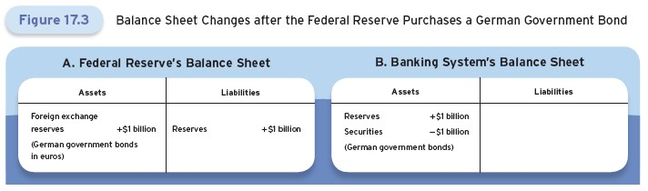
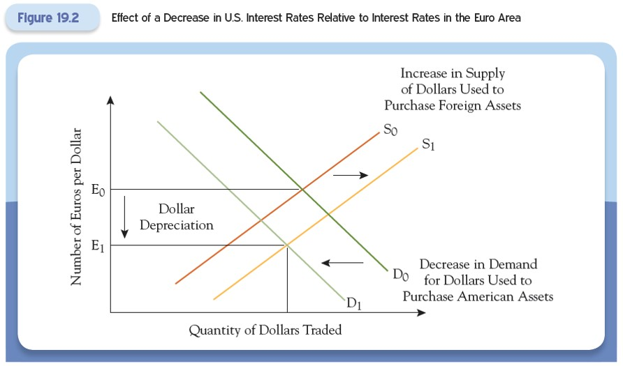

# Lecture 10: Exchange-Rate Policy and Central Bank

**Instructor:** Fei Tan

 @econdojo &nbsp;&nbsp;&nbsp;&nbsp;  @BusinessSchool101 &nbsp;&nbsp;&nbsp;&nbsp;  Saint Louis University

**Course:** Monetary Economics
**Date:** February 13, 2026

---

## Overview

This lecture studies the link between a country's exchange rate policy and its domestic monetary policy.

**Key insight:**
- Central banks must choose between a fixed exchange rate and an independent monetary policy.
- Trilemma of international finance: A country cannot simultaneously [i.] maintain a fixed exchange rate; [ii.] conduct independent monetary policy; [iii.] allow free capital flows

---

## The Road Ahead

1. [Exchange-Rate Policy and Domestic Monetary Policy](#long-run-inflation-and-ppp)
2. [Mechanics of Exchange-Rate Management](#mechanics-of-exchange-rate-management)

---

## Long-Run: Inflation and PPP

The theory of purchasing power parity (PPP) extends the law of one price to a basket of goods and services. Taking percentage changes of the PPP condition:

$$\text{\% change in } E \approx \underbrace{\text{\% change in } P^*}_{\text{U.K. inflation}} - \underbrace{\text{\% change in } P}_{\text{U.S. inflation}}$$

**Implication:** Pound depreciates (appreciates) when U.K. inflation exceeds (falls below) U.S. inflation.

**Long-run constraint:** Bank of England must choose between

- Fixing the exchange rate and matching U.S. inflation
- Setting independent monetary policy and allowing the exchange rate to float

---

## Short-Run: Interest Rates and Capital Arbitrage

Arbitrage in capital markets ensures equal expected returns on U.S. and U.K. bonds:

$$1 + i_t = (1 + i_t^*)\left(\frac{E_t}{E_{t+1}^e}\right)$$

Under a credible fixed exchange rate ($E_t = E_{t+1}^e$), this implies $i_t = i_t^*$.

**Short-run constraint:** Bank of England must choose between

- Fixing the exchange rate and matching U.S. interest rates
- Setting independent monetary policy and allowing the exchange rate to float

---

## Impossible Trinity

If a country forgoes participating in international capital markets, it can impose **capital controls** and potentially achieve both goals. Policymakers must choose two of the three:

1. Be open to international capital flows
2. Control domestic interest rate
3. Fix exchange rate

**Policy choices in practice:**

- Large economies (U.S., Eurozone) prioritize free capital flows and monetary independence, letting exchange rates float.
- Small open economies may prioritize exchange rate stability given dramatic impacts of exchange rate changes.

---

## Mechanics of Exchange-Rate Management

How do central banks actually manage exchange rates?

**Mechanism:** Central banks can fix exchange rates by offering to buy and sell their country's currency at the fixed rate.

**Implication:** Controlling the exchange rate means giving up control of the size of reserves, so the market determines the interest rate.

---

## Foreign Exchange Intervention

Suppose the U.S. Treasury instructs the Fed to purchase $1 billion worth of euros.

Mechanism:
- Fed buys German government bonds (denominated in euros)
- Pays foreign exchange departments of commercial banks with dollars

Impact on Fed's balance sheet:
- Assets increase by $1 billion (foreign exchange reserves)
- Liabilities increase by $1 billion (bank reserves)
- Monetary base increases by $1 billion

---

## Effects on Money Supply and Interest Rates

Through money multiplier:
- Monetary base increases
- Quantity of money in economy increases
- Supply of reserves to banking system increases

Effect on interest rates:
- Increased reserve supply puts downward pressure on interest rates
- Buying euros (selling dollars) lowers U.S. interest rates

This is an **unsterilized** foreign exchange intervention (changes the monetary base).

---

## Impact on Exchange Rate

