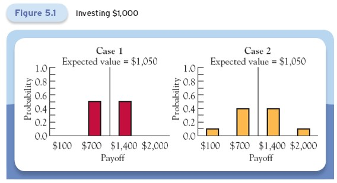
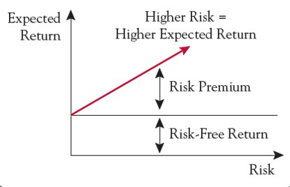
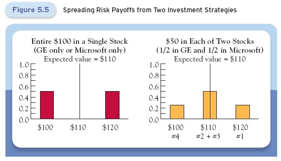

# Lecture 3: Understanding Risk

**Instructor:** Fei Tan

 @econdojo &nbsp;&nbsp;&nbsp;&nbsp;  @BusinessSchool101 &nbsp;&nbsp;&nbsp;&nbsp;  Saint Louis University

**Course:** Monetary Economics
**Date:** January 17, 2026

---

## Overview

This lecture studies how to measure risk and assess its impact on financial instrument prices and demand.

**Key insights:**
- Risk measurement tools originated from analyzing games of chance
- Risk cannot be eliminated, but can be effectively managed
- Risk creates opportunities - investors are compensated for bearing risk
- Measuring risk is essential for pricing and transferring risk

---

## The Road Ahead

1. [Defining Risk](#defining-risk)
2. [Measuring Risk](#measuring-risk)
3. [Risk-Return Tradeoff](#risk-return-tradeoff)
4. [Sources of Risk](#sources-of-risk)
5. [Reducing Risk through Diversification](#reducing-risk-through-diversification)

---

## Defining Risk

Risk is a measure of uncertainty about the future payoff to an investment, assessed over some time horizon and relative to a benchmark.

**Remarks:**
- Risk is a measure that can be quantified. Uncertainties that are not quantifiable cannot be priced
- Risk arises from uncertainty about the future
- Risk has to do with the future payoff of an investment, which is unknown
- This definition of risk refers to an investment or group of investments
- Risk must be assessed over some time horizon
- Risk must be assessed relative to a benchmark rather than in isolation

---

## Measuring Risk

**Probability** is a measure, expressed as a number between zero and one, of the likelihood that an event will occur. We will use some elementary tools from probability theory to measure risk.

**Example:** If we flip a fair coin, the probabilities that it will come down head or tail are both one-half.

**Key principle:** The probabilities of all the possibilities are always non-negative and sum up to one.

We can now compute the **expected value** or mean of an investment with more than one possible returns or **payoffs**.

---

## Case 1: Two Possible Payoffs

Suppose that for $\$1,000$ we can purchase a stock whose value is equally likely to fall to $\$700$ or rise to $\$1,400$.

If we had purchased this stock one million times, about half million times the stock would pay off $\$700$ and the other half million times it would pay off $\$1,400$.

Average payoff from one million investments:

$$\begin{align}
\underbrace{\$1,050}_{\text{EV}} &= \frac{500,000 \times \$700 + 500,000 \times \$1,400}{1,000,000} \\
&= \frac{1}{2} \times \$700 + \frac{1}{2} \times \$1,400
\end{align}$$

This is also the **expected value (EV)** of the stock. It shows that the expected value is the probability-weighted sum of the possible payoffs.

---

## Case 2: Four Possible Payoffs

Suppose that the stock now can yield four possible payoffs:
- $\$100$ (probability 0.1)
- $\$700$ (probability 0.4)
- $\$1,400$ (probability 0.4)
- $\$2,000$ (probability 0.1)

Expected value of the stock:

$$\$1,050 = 0.1 \times \$100 + 0.4 \times \$700 + 0.4 \times \$1,400 + 0.1 \times \$2,000$$

Note that $0.1 + 0.4 + 0.4 + 0.1 = 1$.

**Key observation:** The two $\$1,000$ investments both yield an expected return of $\$50$, or an expected return rate of 5%, but they carry different levels of risk.

---

## Measures of Risk

The two examples suggest that we measure risk by quantifying the spread among an investment's possible outcomes.

**Risk-free asset:** An investment whose future value is known with certainty (i.e. with probability one) and whose return is the risk-free rate of return.

**Two measures of risk:**
1. Variance and Standard Deviation
2. Value at Risk (VaR)

---

## Variance and Standard Deviation

**Variance (Var)** is defined as the average of the squared deviations of the possible outcomes from their expected value, weighted by their probabilities.

For Case 1:

$$\underbrace{122,500 \text{ (dollars}^2)}_{\text{Var}} = \frac{1}{2}(\$1,400 - \$1,050)^2 + \frac{1}{2}(\$700 - \$1,050)^2$$

**Standard deviation (s.d.)** is simply the (positive) square root of the variance:

$$\text{s.d.} = \sqrt{\text{Var}} = \sqrt{122,500 \text{ (dollars}^2)} = \$350$$

This is more useful than the variance because it is measured in the same unit as the payoffs.

---

## Comparing Standard Deviations

For Case 2: $\text{s.d.} = \$528$. Because the two investments have the same expected value, most people would prefer the first.

**Key principle:** The greater the standard deviation, the higher the risk.

Standard deviation measures the spread of all possible outcomes around the expected value.

---

## Value at Risk

**Value at risk (VaR)** is the worst possible loss over a specific time horizon, at a given probability.

It measures the riskiness of the worst outcome rather than the spread of all outcomes measured by standard deviation.

**Comparison:**
- Case 1: VaR is $\$300$ with probability 0.5
- Case 2: VaR is $\$900$ with probability 0.1

VaR focuses on downside risk rather than overall variability.

---

## Risk-Return Tradeoff

**Investor types:** Risk-averse investors prefer certain returns over risky ones with the same expected return, while risk-neutral investors only care about expected return.

**Key insights:**
- Risky investments must offer an extra return, called **risk premium**, because investors require compensation for taking risk
- The riskier an investment, the higher the risk premium and expected return

---

## Sources of Risk

We can classify all risks into one of two groups:

**Idiosyncratic risks** (or unique risks):
- Those affecting a small number of people but no one else
- Example: The risk that Ford's stock price may go up or down is idiosyncratic because it only affects Ford and its shareholders

**Systematic risks** (or economy-wide risks):
- Those affecting everyone
- Example: Macroeconomic factors, such as swings in consumer and business confidence, are sources of systematic risks that affect all firms and individuals

---

## Reducing Risk through Diversification

Risk can be reduced through diversification, the principle of holding more than one risk at a time.

**Key insight:** Holding several different investments can reduce the idiosyncratic risk an investor bears.

Two ways to diversify an investment:
1. Hedging risk
2. Spreading risk

---

## Hedging Risk

Hedging is the strategy of reducing idiosyncratic risk by making two investments with opposing risks.

**Example:** Suppose oil prices have an equal chance of rising or falling.

Texaco (oil company):
- Oil prices rise → $\$120$ payoff per $\$100$ invested
- Oil prices fall → $\$100$ payoff per $\$100$ invested

GE (general company):
- Oil prices rise → $\$100$ payoff per $\$100$ invested
- Oil prices fall → $\$120$ payoff per $\$100$ invested

Increases in oil price are bad for most of the economy, but good for oil companies.

---

## Strategies without Hedging

**Strategy 1:** Invest $\$100$ in GE

Expected payoff:
$$\$110 = \frac{1}{2} \times \$120 + \frac{1}{2} \times \$100$$

Standard deviation:
$$\$10 = \sqrt{\frac{1}{2} \times (\$120 - \$110)^2 + \frac{1}{2} \times (\$100 - \$110)^2}$$

**Strategy 2:** Invest $\$100$ in Texaco

Same EV and s.d. as Strategy 1

---

## Strategy with Hedging

**Strategy 3:** Invest $\$50$ in GE and $\$50$ in Texaco

Expected payoff:
$$\$110 = \frac{1}{2} \times (\$60 + \$50) + \frac{1}{2} \times (\$60 + \$50)$$

Standard deviation:
$$\$0 = \sqrt{\frac{1}{2} \times (\$60 + \$50 - \$110)^2 + \frac{1}{2} \times (\$60 + \$50 - \$110)^2}$$

Strategy 3 guarantees a payoff of $\$110$, regardless of whether oil prices go up or down.

**Key insight:** Hedging has eliminated the risk entirely in this example.

---

## Spreading Risk

Spreading is another strategy of reducing idiosyncratic risk by making several investments with unrelated payoffs.

**Example:** Suppose that GE and Microsoft's payoffs are independent of each other and both pay off either $\$120$ or $\$100$ with equal probability for each $\$100$ invested.

**Strategy 1:** Invest $\$100$ in GE, EV = $\$110$, s.d. = $\$10$

**Strategy 2:** Invest $\$100$ in Microsoft, same EV and s.d. as Strategy 1

**Strategy 3:** Invest $\$50$ in GE and $\$50$ in Microsoft

Expected payoff:
$$\begin{align}
\$110 &= \frac{1}{4} \times (\$60 + \$60) + \frac{1}{4} \times (\$60 + \$50) + \frac{1}{4} \times (\$50 + \$60) + \frac{1}{4} \times (\$50 + \$50)
\end{align}$$

Standard deviation:
$$\$7.1 = \sqrt{\frac{1}{4} \times (\$60 + \$60 - \$110)^2 + \frac{1}{4} \times (\$50 + \$50 - \$110)^2}$$

---

## Spreading Reduces Risk

By spreading the investment among independently risky investments, Strategy 3 lowers the spread of the outcomes and hence the risk.

When the investment is split between the two stocks, the payoff becomes $\$110$ or higher with probability 0.75 and $\$100$ with only probability 0.25.

---

## Math Appendix

We will show how diversification reduces risk in general.

Let $(x,y)$ be the payoff pair to buying GE and Texaco stocks and $p_i$ the probability associated with a particular outcome $(x_i, y_i)$.

The actual payoff on the investment is:
$$\text{actual payoff} = ax + by$$

where $0 \leq a, b \leq 1$ are the proportions of the investment made in GE and Texaco, respectively, and satisfy $a + b = 1$.

---

## Risk Hedging

**Variance formula:**

$$\text{Var}(ax + by) = a^2\text{Var}(x) + b^2\text{Var}(y) + 2ab\text{Cov}(x,y)$$

where $\text{Cov}(x,y) = \sum_i p_i(x_i - \overline{x})(y_i - \overline{y})$ measures the extent to which two risky assets move together, and $\text{EV}(x)=\overline{x} = \sum_i p_i x_i$, $\text{EV}(y)=\overline{y} = \sum_i p_i y_i$.

**GE/Texaco example:** With $a = b = 1/2$:

$$\text{Var}(x) = \text{Var}(y) = 100, \quad \text{Cov}(x,y) = -100, \quad \text{Var}\left(\frac{1}{2}x + \frac{1}{2}y\right) = 0$$

**Conclusion:** The two stocks behave as hedges for each other.

---

## Risk Spreading

Assume there are $n$ independent investments $\{x^i\}_{i=1}^n$, each with the same expected payoff $\overline{x}$ and the same variance $\sigma_x^2$.

If we hold $1/n$ of our portfolio in each stock, then the expected payoff is:

$$\text{EV}\left(\sum_{i=1}^n \frac{x^i}{n}\right) = \frac{1}{n}\sum_{i=1}^n \text{EV}(x^i) = \overline{x}$$

Since the payoff on each stock is independent of all the rest, all the covariances are zero and hence the variance is:

$$\text{Var}\left(\sum_{i=1}^n \frac{x^i}{n}\right) = \frac{1}{n^2}\sum_{i=1}^n \text{Var}(x^i) = \frac{\sigma_x^2}{n}$$

**Key result:** The variance declines as $n$ increases; when the value of $n$ is extremely large, the variance is essentially zero.
