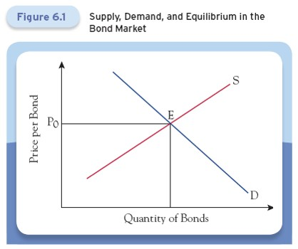

# Lecture 4: Bonds, Bond Prices, and the Determination of Interest Rates

**Instructor:** Fei Tan

 @econdojo &nbsp;&nbsp;&nbsp;&nbsp;  @BusinessSchool101 &nbsp;&nbsp;&nbsp;&nbsp;  Saint Louis University

**Course:** Monetary Economics
**Date:** February 4, 2026

---

## Overview

Any financial arrangement involving the current transfer of resources from a lender to a borrower, with a transfer back at some time in the future, is a form of a bond.

**Key topics:**
- The relationship between bond prices and interest rates
- The determination of bond prices in the market (by supply and demand)
- Why bonds are risky

---

## The Road Ahead

1. [Bond Prices](#zero-coupon-bonds)
2. [Bond Yields](#bond-yields)
3. [Bond Market](#bond-supply-bond-demand-and-equilibrium)
4. [Why Bonds Are Risky](#default-risk)

---

## Zero-Coupon Bonds

**U.S. Treasury bill (T-bill)** is an example of zero-coupon bond because each T-bill represents a promise by the U.S. government to pay $\$100$ on a fixed future date but without coupon payments.

**Remarks:**
- Let $i$ be the interest rate and $n$ the time until the payment is made. Then the price of a T-bill (TB) is:

$$P_{TB} = \frac{\$100}{(1+i)^n}$$

- Given the price of a zero-coupon bond, we can also compute the interest rate as:

$$i = \sqrt[n]{\$100/\$P_{TB}} - 1 = \left(\frac{\$100}{\$P_{TB}}\right)^{1/n} - 1$$

---

## Fixed-Payment Loans

Conventional home mortgages and car loans are examples of **fixed-payment loans** because they promise a fixed number of equal payments at regular intervals.

Let $i$ be the interest rate, $\$C$ the fixed payment, and $n$ the number of payments. Then the price of a fixed-payment loan (FL) is:

$$P_{FL} = \frac{\$C}{1+i} + \frac{\$C}{(1+i)^2} + \cdots + \frac{\$C}{(1+i)^n}$$

---

## Consols

**Consols** or **perpetuities** are bonds whose interest payments last forever and the borrower never repays the principal.

Let $i$ be the interest rate and $\$C$ the interest payment. Then the price of a consol (C) is:

$$P_C = \lim_{n\to\infty}\sum_{k=1}^n\frac{\$C}{(1+i)^k} = \lim_{n\to\infty}\frac{\$C}{i}\left[1-\frac{1}{(1+i)^n}\right] = \frac{\$C}{i}$$

---

## Bond Yields

Bonds of different maturities each have a price and an associated interest rate called the **yield to maturity**, or simply the **yield**.

**Concepts:**
- Yields on bonds with a short maturity (typically a year or less) are called **short-term interest rates**
- Yields on bonds with a longer maturity are called **long-term interest rates**
- The relation between maturity and yield is called the **yield curve**, or the **term structure of interest rates**

With the information about the promised payments and the bond price, we can obtain the bond yield.

---

## Yield to Maturity

Yield to maturity measures the return on holding a bond to its maturity when the principal payment is made.

**Example:** For a one-year 5% coupon bond: $P_{CB} = \frac{\$5}{1+i} + \frac{\$100}{1+i}$ where $i$ is the yield.

**Three cases:**

1. $P_{CB} = \$100$ face value: Yield equals the 5% coupon rate
2. $P_{CB} < \$100$ (e.g., $\$99.06$): Yield (6%) is above the coupon rate due to **capital gain** ($\$100 - \$99.06 = \$0.94$)
3. $P_{CB} > \$100$ (e.g., $\$100.96$): Yield (4%) is below the coupon rate due to **capital loss** ($\$100.96 - \$100 = \$0.96$)

**Note:** These remarks also apply to coupon bonds with longer maturities.

---

## Current Yield

Current yield measures the return from coupon payments only: $\frac{\$C}{\$P_{CB}}$ (ignore capital gain/loss).

**One-year 5% coupon bond:**

1. $P_{CB} = \$100$ face value: Current yield = Yield to maturity = Coupon rate (no capital gain/loss)

2. $P_{CB} < \$100$ (e.g., $\$99$): Current yield (5.05%) is above coupon rate but below yield to maturity (6.06%) due to $\$1$ capital gain

3. $P_{CB} > \$100$ (e.g., $\$101$): Current yield (4.95%) is below coupon rate but above yield to maturity (3.96%) due to $\$1$ capital loss

**Key insight:** Current yield moves in the opposite direction from bond price.

---

## Summary: Bond Price and Yields

| Bond Price | Coupon Rate vs. Current Yield | Current Yield vs. Yield to Maturity |
|------------|-------------------------------|----------------------|
| Price = Face Value | Coupon Rate = Current Yield | Current Yield = Yield to Maturity |
| Price < Face Value | Coupon Rate < Current Yield | Current Yield < Yield to Maturity |
| Price > Face Value | Coupon Rate > Current Yield | Current Yield > Yield to Maturity |

---

## Holding Period Returns

Holding period return is the return to buying a bond and selling it before maturity (can differ from yield to maturity).

**Formula:**

$$\begin{align}
\text{1-year holding period return} &= \frac{\text{yearly coupon payment}}{\text{price paid}} + \frac{\text{price sold} - \text{price paid}}{\text{price paid}} \\
&= \text{current yield} + \text{capital gain rate}
\end{align}$$

**Example:** Pay $\$100$ for a 10-year 6% coupon bond, sell as 9-year bond one year later:
- If interest rate stays at 6%: return = $6\%$ (equals yield to maturity)
- If interest rate changes: return differs due to capital gain/loss

**Key insight:** Interest rate movements create risk. The longer the bond term, the greater the price movements and associated risk.

---

## Holding Period Returns (Cont'd)

If the interest rate falls from 6% to 5% over the year we hold the bond, then the 9-year bond price is:

$$\$107.11 = \sum_{k=1}^9\frac{\$6}{(1+5\%)^k} + \frac{\$100}{(1+5\%)^9}$$

and so the one-year holding period return is:

$$13.11\% = \frac{\$6}{\$100} + \frac{\$107.11-\$100}{\$100}$$

which is above the yield to maturity because of the "surprise" $\$7.11$ capital gain.

---

## Holding Period Returns (Cont'd)

If the interest rate rises from 6% to 7% over the year we hold the bond, then the 9-year bond price is:

$$\$93.48 = \sum_{k=1}^9\frac{\$6}{(1+7\%)^k} + \frac{\$100}{(1+7\%)^9}$$

and so the one-year holding period return is:

$$-0.52\% = \frac{\$6}{\$100} + \frac{\$93.48-\$100}{\$100}$$

which is below the yield to maturity because of the "surprise" $\$6.52$ capital loss.

---

## Bond Supply, Bond Demand, and Equilibrium

- Bond prices (and hence bond yields) are determined by the interaction between bond supply and bond demand.

---

## Factors that Shift Bond Supply

1. **Changes in government borrowing:** Any increase in government's borrowing needs increases the quantity of bonds outstanding, shifting the supply curve to the right → Bond price falls and interest rate rises.

2. **Changes in general business conditions:** As business conditions improve, firms have increasing borrowing needs, shifting the supply curve to the right → Bond price falls and interest rate rises.

3. **Changes in expected inflation:** At a given nominal interest rate, higher expected inflation lowers real interest rate and hence borrowing cost, shifting the supply curve to the right → Bond price falls and interest rate rises.

---

## Factors that Shift Bond Demand

1. **Wealth:** Increases in wealth increase investment in bonds, shifting demand right → Bond price rises, interest rate falls.

2. **Expected inflation:** Lower expected inflation increases real return on bonds, shifting demand right → Bond price rises, interest rate falls.

3. **Expected returns:** If expected return on bonds rises (e.g. due to lower expected interest rate) relative to alternatives, demand shifts right → Bond price rises, interest rate falls.

4. **Risk relative to alternatives:** If a bond becomes less risky relative to alternatives, demand shifts right → Bond price rises, interest rate falls.

5. **Liquidity relative to alternatives:** If a bond becomes more liquid relative to alternatives, demand shifts right → Bond price rises, interest rate falls.

---

## Understanding Changes in Equilibrium

We will look at two factors that shift both the bond supply and demand curves:

**1. Changes in expected inflation:**
- Higher expected inflation shifts the supply curve to the right and demand curve to the left
- Bond price falls and interest rate rises

**2. Changes in general business conditions:**
- A business-cycle downturn shifts the supply and demand curves both to the left
- Bond price can either rise or fall

---

## Default Risk

Default risk is the chance that the bond's issuer may fail to make the promised payment.

**Example:** One-year 5% coupon bond, 5% risk-free rate. 

- Without default risk, price of one-year 5% coupon bond: $P_1 = \frac{\$105}{1.05} = \$100$

- With 10% probability of default (receiving $\$0$), the bond price or expected present value (EPV) becomes:

    $$\underbrace{P_2}_{\text{EPV}} = \frac{0.9 \times \$105 + 0.1 \times \$0}{1.05} = \$90$$

    The promised yield to maturity is: $16.67\% = \frac{\$105}{\$90} - 1$. This implies a **default-risk premium** of $16.67\% - 5\% = 11.67\%$.

**Note:** Only risk-neutral investors pay $P_2$. Risk-averse investors pay less to get higher yield.

---

## Inflation Risk

Inflation risk is the chance that inflation may turn out to be higher than expected, thereby reducing the real return on holding the bond.

To account for such risk, consider the following modified version of the Fisher relation:

$$i_t \approx r_t + \pi_{t+1}^e + \text{compensation for inflation risk}$$

**Key insight:** The greater the inflation risk (measured by inflation standard deviation), the larger the compensation for it, the higher the nominal interest rate.

---

## Interest-Rate Risk

Interest-rate risk is the chance that the bond price may fall between the time a bond is purchased and the time it is sold.

See the example of holding period return above.

**Key insight:** The longer the bond term, the greater the price movements and the associated interest-rate risk.
