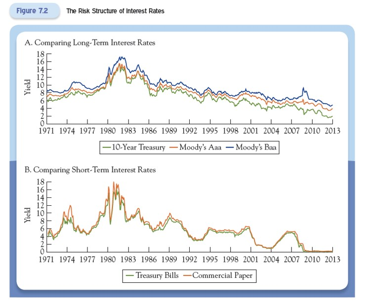
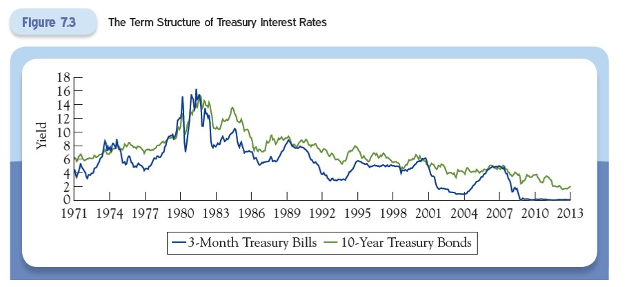
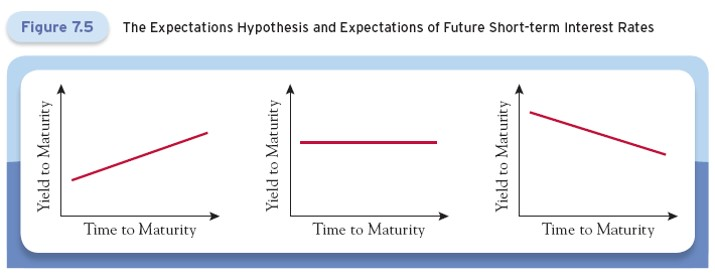
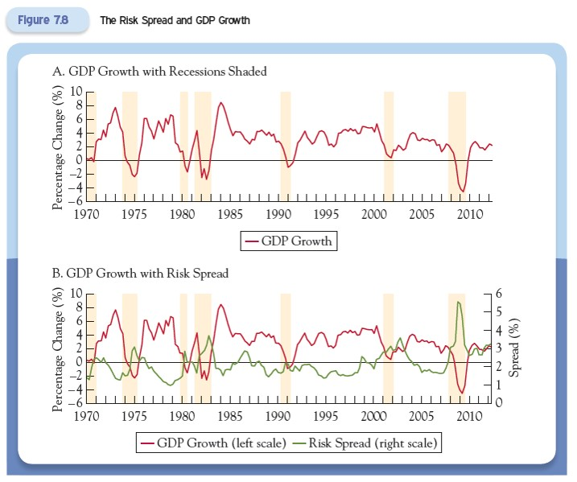
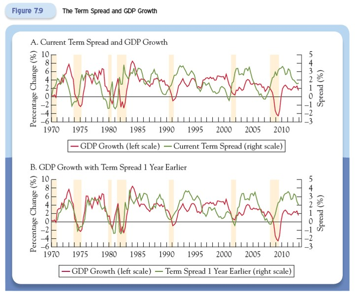

# Lecture 5: Risk and Term Structure of Interest Rates

**Instructor:** Fei Tan

 @econdojo &nbsp;&nbsp;&nbsp;&nbsp;  @BusinessSchool101 &nbsp;&nbsp;&nbsp;&nbsp;  Saint Louis University

**Course:** Monetary Economics
**Date:** February 9, 2026

---

## Overview

This lecture introduces three factors that affect bond yields: default risk, taxes, and maturity.

**Key focus:**
- The relationship among bonds with the same risk characteristics but different maturities, called the **term structure of interest rates**
- Two main explanations for the term structure
- Information contained in the risk structure and term structure of interest rates

---

## The Road Ahead

1. [Risk Structure of Interest Rates](#risk-structure-of-interest-rates)
2. [Tax Status and Bond Types](#tax-status-and-bond-types)
3. [Term Structure of Interest Rates](#term-structure-of-interest-rates)
4. [Information Content of Interest Rates](#information-content-of-interest-rates)

---

## Risk Structure of Interest Rates

Everything else held equal, a ratings downgrade signifies a higher risk of default, shifting the bond demand curve to the left → Bond price falls, bond yield rises.

Any bond yield can be decomposed as follows:

$$\text{bond yield} = \underbrace{\text{U.S. Treasury yield}}_{\text{benchmark}} + \underbrace{\text{default risk premium}}_{\text{risk spread}}$$

**Key insight:** When Treasury yields move, all other yields move with them.

---

## Risk Structure of Interest Rates (cont'd)

---

## Tax Status and Bond Types

**Taxable bonds:**
- Privately issued bonds
- Bondholders must pay income tax on interest income

**Municipal (tax-exempt) bonds:**
- Issued by state and local governments
- Coupon payments are exempt from federal taxation

$$\text{tax-exempt bond yield} = \text{taxable bond yield} \times (1 - \text{tax rate})$$

**Example:** With a 30% tax rate and 10% taxable bond yield, tax-exempt bond yield is $10\% \times (1 - 0.30) = 7\%$

**Key insight:** The higher the tax rate, the wider the gap between the two yields. Investors base their decisions on the tax-exempt yield.

---

## Term Structure of Interest Rates

The term structure of interest rates is the relationship among bonds with the same risk characteristics but different maturities.

**Three key observations:**
1. Interest rates of different maturities tend to move together
2. Yields on short-term bonds are more volatile than yields on long-term bonds
3. Long-term yields tend to be higher than short-term yields

---

## Explanation 1: Expectations Hypothesis

The expectations hypothesis assumes there is no uncertainty about the future. Bonds of different maturities are perfect substitutes for each other.

**Example:** An investor with a two-year horizon has two equivalent strategies:
1. Invest $\$1$ in a two-year bond and hold to maturity
    - Interest rate: $i_{2t}$ (2 = two years, $t$ = current period)
    - Payoff in two years: $(1 + i_{2t})^2$ dollars
2. Invest $\$1$ in two one-year bonds sequentially
    - Current one-year rate: $i_{1t}$
    - Expected one-year rate next period: $i_{1t+1}^e$ ($e$ = expected)
    - Payoff in two years: $(1 + i_{1t})(1 + i_{1t+1}^e)$ dollars

---

## Indifference Condition

Indifference between the two strategies means:

$$(1 + i_{2t})^2 = (1 + i_{1t})(1 + i_{1t+1}^e)$$

A useful approximation:

$$i_{2t} \approx \frac{i_{1t} + i_{1t+1}^e}{2} \quad \Rightarrow \quad i_{1t+1}^e \approx 2i_{2t} - i_{1t}$$

More generally, the interest rate on an $n$-year bond is approximately the average of $n$ expected future one-year interest rates:

$$i_{nt} \approx \frac{i_{1t} + i_{1t+1}^e + i_{1t+2}^e + \cdots + i_{1t+n-1}^e}{n}$$

---

## Interpreting the Yield Curve

**Upward-sloping yield curve:**
- Long-term rate ($i_{2t}$) > short-term rate ($i_{1t}$)
- Financial markets expect short-term rates to rise in the future

**Downward-sloping yield curve:**
- Long-term rate ($i_{2t}$) < short-term rate ($i_{1t}$)
- Financial markets expect short-term rates to fall in the future

The yield curve shape reveals market expectations about future interest rates.

---

## Can Expectations Hypothesis Explain Three Observations?

**Observation 1:** Interest rates of different maturities move together
- ✓ **Explained:** If $i_{1t}$ changes, all yields at higher maturities change in the same direction

**Observation 2:** Short-term yields are more volatile than long-term yields
- ✓ **Explained:** Long-term yields are averages of expected future short-term yields, so they are less volatile

**Observation 3:** Long-term yields are normally higher than short-term yields
- ✗ **Not explained:** The yield curve slopes upward only when rates are expected to rise, but data shows rates have been trending downward

---

## Explanation 2: Liquidity Premium Theory

The liquidity premium theory extends the expectations hypothesis to include risk.

Two components of bond yield:
1. **Risk-free rate** (explained by expectations hypothesis)
2. **Risk premium** (explained by inflation and interest-rate risk)

$$i_{nt} = rp_n + \frac{i_{1t} + i_{1t+1}^e + i_{1t+2}^e + \cdots + i_{1t+n-1}^e}{n}$$

where $rp_n$ is the risk premium for an $n$-year bond.

---

## Risk Premium and Maturity

**Key insight:** The risk premium $rp_n$ is an increasing function of maturity $n$.

Longer maturity → Higher inflation and interest rate risk → Higher risk premium

**Implications:**
1. Long-term yields are normally higher than short-term yields
2. Yield curve normally slopes upward
3. A flat curve means interest rates are expected to fall
4. A downward-sloping curve means interest rates are expected to decline significantly

---

## Information Content of Interest Rates

The risk and term structure of interest rates contain valuable information for predicting overall economic conditions.

**Two key indicators:**

1. **Increasing risk spread** (difference between corporate and Treasury yields)
   - Signals deteriorating credit conditions
   - Predicts economic slowdown

2. **Inverted yield curve** (short-term rates > long-term rates)
   - Historically precedes recessions
   - Reflects expectations of future economic weakness and declining interest rates

---

## Risk Spread as an Economic Indicator

---

## Yield Curve as an Economic Predictor

