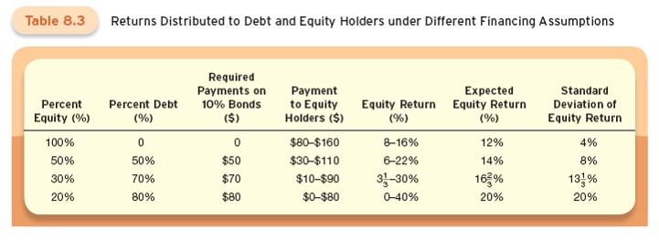

# Lecture 6: Stocks, Stock Markets, and Market Efficiency

**Instructor:** Fei Tan

 @econdojo &nbsp;&nbsp;&nbsp;&nbsp;  @BusinessSchool101 &nbsp;&nbsp;&nbsp;&nbsp;  Saint Louis University

**Course:** Monetary Economics
**Date:** February 13, 2026

---

## Overview

For individuals, stocks are a key instrument for holding wealth; for companies, they are one of several ways to obtain financing.

**Key insight:**
- Stock markets are central links between the financial world and the real economy
- Understanding stock valuation is essential for investors and policymakers
- Efficient markets theory helps explain stock price behavior

---

## The Road Ahead

1. [Essential Characteristics of Stock](#essential-characteristics-of-stock)
2. [Valuing Stocks](#valuing-stocks)
3. [Market Efficiency](#market-efficiency)

---

## Essential Characteristics of Stock

Stocks, also known as equity, are shares in a firm's ownership. When a firm issues stock, it sells part of itself so that the buyer becomes a part owner.

**Three characteristics:**

1. Small denominations: Shares are issued in small units, allowing investors to buy as little or as much of the company as they want

2. Transferable: Owners can sell their shares to someone else

3. Residual claimants with limited liability: Stockholders receive what is left after all other creditors are paid, but the maximum they can lose is their initial investment if the company goes bankrupt

---

## Measuring Stock Market

Changes in stock values affect consumption and saving patterns, causing general economic activity to fluctuate.

| Index | Companies | Weighting | Key Feature |
|-------|-----------|-----------|-------------|
| **DJIA** | 30 largest | Price-weighted | Higher-priced stocks dominate |
| **S&P 500** | 500 largest | Value-weighted | Higher market value stocks dominate |
| **Nasdaq** | ~3,000 | Value-weighted | Heavy tech representation |
| **Wilshire 5000** | All publicly traded | Value-weighted | Most comprehensive |

---

## Valuing Stocks

The fundamental value of a firm's stock depends on its current assets and estimates of future profitability.

**Key question:** What determines the price of a stock?

We will develop the **dividend-discount model** to answer this question by:
1. Starting with a simple one-year investment
2. Extending to multiple periods
3. Incorporating dividend growth
4. Adding risk considerations

---

## One-Year Investment

Suppose an investor plans to buy a stock today and sell it in one year.

**Notation:**
- $P_t$ = purchase price today
- $P_{t+1}$ = sale price one year later
- $D_{t+1}$ = dividend payment next year
- $i$ = interest rate for computing present value

**Stock price today:**

$$P_t = \frac{D_{t+1}}{1+i} + \frac{P_{t+1}}{1+i}$$

---

## Multi-Period Extension

Similarly, the stock price next year is:

$$P_{t+1} = \frac{D_{t+2}}{1+i} + \frac{P_{t+2}}{1+i}$$

Substituting this into the previous equation:

$$P_t = \frac{D_{t+1}}{1+i} + \frac{D_{t+2}}{(1+i)^2} + \frac{P_{t+2}}{(1+i)^2}$$

Repeating this process for $n$ periods:

$$P_t = \frac{D_{t+1}}{1+i} + \frac{D_{t+2}}{(1+i)^2} + \cdots + \frac{D_{t+n}}{(1+i)^n} + \frac{P_{t+n}}{(1+i)^n}$$

**Interpretation:** Stock price today is the present value of all future dividends plus the present value of the sale price $n$ years from now.

---

## Dividend-Discount Model

Assume dividends grow at a constant rate $g$ per year:

$$D_{t+n} = D_t(1+g)^n$$

If the firm pays dividends forever (i.e., $n \to \infty$), the stock price becomes:

$$P_t = \frac{D_t(1+g)}{i-g} \quad \text{for } i > g$$

**Key insight:** Stock prices should be high when:
- Current dividends ($D_t$) are high
- Dividend growth ($g$) is rapid
- Interest rate ($i$) is low

---

## Why Stocks Are Risky

**Leverage** is the practice of borrowing to finance part of an investment, and it creates risk.

**Example:** A software company needs a $\$1,000$ computer financed by stock/bonds (10% rate). Earnings: $\$160$ (good years) or $\$80$ (bad years) with equal probability.

**Key insight:** The more debt, the more leverage, and the greater the stockholders' risk because they are residual claimants.

---

## Risk and the Value of Stocks

Stockholders require compensation for bearing risk. The higher the risk, the greater the compensation required.

**Dividend-discount model with risk:**

$$P_t = \frac{D_t(1+g)}{rf + rp - g}$$

where:
- $rf$ = risk-free interest rate
- $rp$ = equity risk premium

**Key insight:** Stock prices are higher when [i.] current dividends are high, [ii.] dividends are expected to grow quickly, [iii.] risk-free rate is low, and [iv.] equity risk premium is low.

---

## Market Efficiency

The theory of efficient markets states that prices of all financial instruments reflect all available information.

**Key implications:**

1. Markets adjust immediately and continuously to changes in fundamental values

2. Stock price movements are unpredictable because they only respond to new information, which by definition is unpredictable

3. No one can consistently beat the market: If prices already reflect all available information, no investor can systematically earn above-average returns

---

## Grossman-Stiglitz Paradox

Grossman and Stiglitz (1980) identified a fundamental problem with perfectly efficient markets: the impossibility of informationally efficient markets.

**Paradox:**

1. If markets were perfectly efficient, prices would fully reflect all information, so no one could profit from costly information gathering
2. Without profit opportunities, no one would have incentive to acquire information
3. But if no one gathers information, how can prices reflect information?

**Resolution:** Markets must be only partially efficient in equilibrium, providing just enough profit opportunities to compensate informed traders for their information costs.
