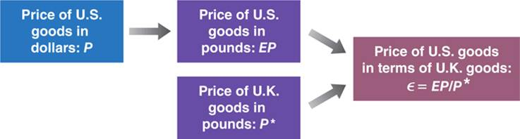
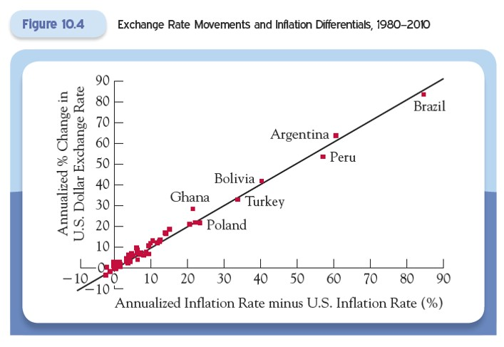
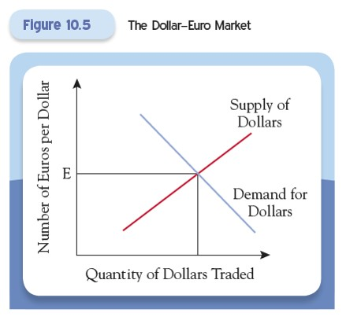

# Lecture 7: Foreign Exchange

**Instructor:** Fei Tan

 @econdojo &nbsp;&nbsp;&nbsp;&nbsp;  @BusinessSchool101 &nbsp;&nbsp;&nbsp;&nbsp;  Saint Louis University

**Course:** Monetary Economics
**Date:** February 13, 2026

---

## Overview

This lecture introduces foreign exchange rates and exchange markets, helping you understand how exchange rates are determined and what accounts for their fluctuation over time.

**Key insights:**
- Exchange rates are the price of one currency in terms of another
- They make international trade possible by facilitating currency exchange
- Changes in exchange rates affect costs of goods and services across countries

---

## The Road Ahead

1. [Foreign Exchange Basics](#nominal-exchange-rate)
2. [Exchange Rates in Long Run](#law-of-one-price)
3. [Exchange Rates in Short Run](#supply-and-demand-for-dollars)

---

## Nominal Exchange Rate

Let $E$ be the nominal exchange rate - the price of domestic currency in terms of foreign currency. Example: If dollar is domestic and pound is foreign, $E$ denotes the price of a dollar in terms of pounds.

Exchange rates change every day:

1. **Nominal appreciation** (↑ $E$): Domestic currency becomes more expensive in terms of foreign currency

2. **Nominal depreciation** (↓ $E$): Domestic currency becomes less expensive in terms of foreign currency

3. **Fixed exchange rate systems:** Increases in $E$ are called revaluations, decreases are called devaluations

---

## Real Exchange Rate

The real exchange rate $\epsilon$ is the price of U.S. goods in terms of British goods.

Real exchange rates also move over time:

1. **Real appreciation** (↑ $\epsilon$): An increase in the relative price of domestic goods in terms of foreign goods

2. **Real depreciation** (↓ $\epsilon$): A decrease in the relative price of domestic goods in terms of foreign goods

**Key insight:** Nominal and real exchange rates can move in opposite directions, but movements in $E$ typically dominate, so $\epsilon$ inherits large fluctuations from $E$.

---

## Uncovered Interest Parity Condition

Consider the choice between U.S. and U.K. one-year bonds from a U.S. investor's viewpoint.
- U.S. bonds return: $(1+i_t)$ dollars per dollar invested
- U.K. bonds return: $E_t(1+i_t^*)/E_{t+1}^e$ dollars per dollar invested

**Arbitrage condition:**

$$1 + i_t = (1 + i_t^*)\left(\frac{E_t}{E_{t+1}^e}\right)$$

---

## Approximation of Interest Parity

$$\underbrace{i_t}_{\text{domestic rate}} \approx \underbrace{i_t^*}_{\text{foreign rate}} - \underbrace{\frac{E_{t+1}^e - E_t}{E_t}}_{\text{expected appreciation of domestic currency}}$$

Factors ignored: Transaction costs and exchange rate risk.

**Bond example** ($i_t = 2\%$ U.S., $i_t^* = 5\%$ U.K.):
- U.S. bonds attractive if pound depreciates > 3%
- U.K. bonds attractive if pound depreciates < 3%

Under fixed rates: If $E_{t+1}^e = E_t$, then $i_t \approx i_t^*$

---

## Exchange Rates in Long Run

We now examine how nominal exchange rates are determined in the long run (e.g., decades).

**Two fundamental concepts:**
1. The law of one price
2. Purchasing power parity (PPP)

Both are based on the concept of **no arbitrage**: identical products should sell for the same price.

---

## Law of One Price

The law of one price states that identical products should sell for the same price when measured in the same currency.

**Example:** TV selling in Detroit and Windsor (Canada)

$$\$P_{\text{Windsor}} = \$P_{\text{Detroit}} \times E$$

where $E$ is the dollar-Canadian dollar exchange rate.

**Limitations:** This law can fail easily in the short run due to:
- Transportation costs
- Tariffs and trade barriers
- Different local taxes

---

## Purchasing Power Parity

Purchasing power parity (PPP) extends the law of one price to a basket of goods and services.

$$1 = \frac{\text{dollar price of one U.S. basket}}{\text{dollar price of one U.K. basket}} = \frac{P}{P^*/E} = \epsilon$$

Rearranging the PPP condition:

$$\underbrace{E}_{\text{pounds per dollar}} = \frac{\text{pound price of one basket in U.K.}}{\text{dollar price of one basket in U.S.}}= \frac{P^*}{P}$$

**Key insight:** Changes in exchange rates are tied to inflation differences between countries.

---

## Exchange Rate Determination

The currency of a country with high inflation will depreciate.

---

## Supply and Demand for Dollars

**Supply of dollars:**
- Americans want to exchange dollars for foreign currencies to:
  1. Purchase goods and services produced abroad
  2. Invest in foreign assets
- Higher exchange rate → more dollars supplied

**Demand for dollars:**
- Foreigners want dollars to purchase U.S. goods, services, and assets
- Lower exchange rate → more dollars demanded

---

## Dollar Market Equilibrium

---

## Shifts in Dollar Supply and Demand

**Supply increases:**
1. Americans prefer foreign goods
2. Higher foreign interest rates
3. Increase in American wealth
4. Lower foreign investment risk
5. Expected dollar depreciation

**Demand increases:**
1. Foreigners prefer U.S. goods
2. Higher U.S. interest rates
3. Increase in foreign wealth
4. Lower U.S. investment risk
5. Expected dollar appreciation
