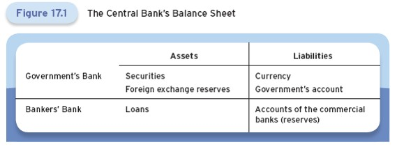
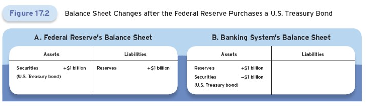
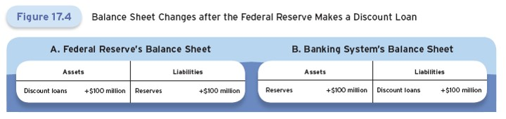
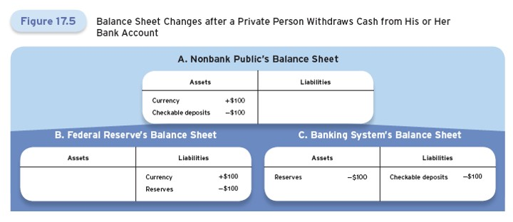
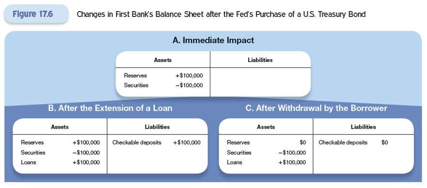
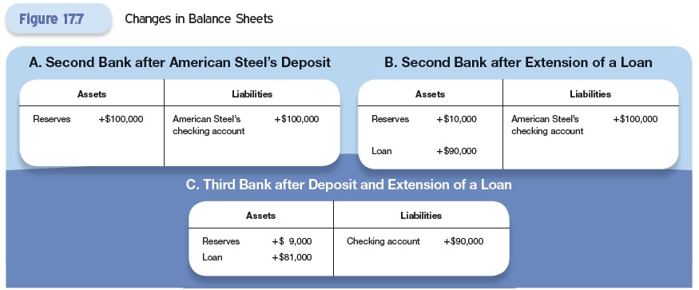
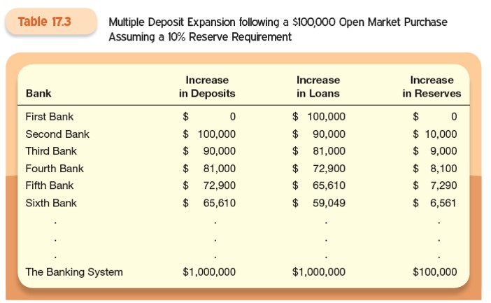

# Lecture 8: Central Bank Balance Sheet and Money Supply Process

**Instructor:** Fei Tan

 @econdojo &nbsp;&nbsp;&nbsp;&nbsp;  @BusinessSchool101 &nbsp;&nbsp;&nbsp;&nbsp;  Saint Louis University

**Course:** Monetary Economics
**Date:** February 13, 2026

---

## Overview

This lecture develops an understanding of how the central bank interacts with the financial system and how its balance sheet is connected to the money and credit that flows through the economy.

**Key insights:**
- Changes in the balance sheet affect the monetary base
- The money multiplier links the monetary base to the money supply
- Understanding these connections is essential for monetary policy analysis

---

## The Road Ahead

1. [Central Bank's Balance Sheet](#central-banks-balance-sheet)
2. [Deposit Expansion Multiplier](#deposit-expansion-process)
3. [Monetary Base and Money Supply](#monetary-base-and-money-supply)

---

## Central Bank's Balance Sheet

Central bank activities cause changes in its balance sheet:
- Supplying currency
- Providing deposit accounts to government and commercial banks
- Making loans
- Buying and selling securities and foreign currency

---

## Assets of Central Bank

1. **Securities** 
   - Primary assets of most central banks
   - Controlled through open market operations (purchases and sales)

2. **Foreign exchange reserves**
   - Central bank's and government's balances of foreign currency
   - Held as bonds issued by foreign governments
   - Used for foreign exchange interventions

3. **Loans**
   - To commercial banks and nonbanks
   - Service to commercial banks

---

## Liabilities of Central Bank

1. **Currency**
   - Principal liability of most central banks
   - Circulating in the hands of the nonbank public

2. **Government's account**
   - Government deposits funds (primarily tax revenues)
   - Government writes checks and makes electronic payments

3. **Commercial bank accounts (reserves)**
   - Sum of deposits at central bank plus vault cash
   - Required reserves: Mandated by regulation
   - Excess reserves: Held voluntarily

**Note**: Monetary Base (high-powered money) = Currency + Reserves

---

## Open Market Operations

The Fed buys or sells securities in financial markets.

**Example:** Fed purchases $1 billion T-bills from a commercial bank

- Fed's assets and liabilities both increase by $1 billion → monetary base ↑ by $1 billion
- Banking system: no change in liabilities, changes in assets sum to zero

---

## Foreign Exchange Intervention

The Fed buys or sells foreign currency reserves.

**Example:** Fed purchases $1 billion worth of euros (buying German government bonds)

- Fed's assets and liabilities both increase by $1 billion → monetary base ↑ by $1 billion
- Banking system: no change in liabilities, changes in assets sum to zero

---

## Discount Loans

The Fed makes loans backed by collateral (assets pledged by borrower).

**Example:** Fed makes $100 million loan to a commercial bank

- Fed's assets and liabilities both increase by $100 million → monetary base ↑ by $100 million
- Banking system: assets and liabilities both increase by $100 million → balance sheet expands

---

## Cash Withdrawal

Cash withdrawal by the nonbank public affects only the composition.

**Example:** Withdraw $100 from an ATM

- Fed: currency outstanding ↑ $100, reserves ↓ $100 → composition changes, monetary base size unchanged
- Banking system: reserves ↓ $100, checkable deposits ↓ $100 → balance sheet shrinks

---

## Deposit Expansion Process

Consider a $100,000 open market purchase by the Fed from First Bank.

**Simplifying assumptions:**
- Banks hold no excess reserves
- No change in currency held by nonbank public

**Process:**
1. First Bank receives $100,000 in reserves
2. First Bank keeps required reserves, lends out the rest
3. Borrowed funds deposited in Second Bank
4. Second Bank keeps required reserves, lends out the rest
5. Process continues...

---

## First Bank Balance Sheet

Initial impact:
- Reserves increase by $100,000
- Securities decrease by $100,000

After lending:
- Reserves kept = required reserves
- Excess reserves lent out

---

## Second Bank Balance Sheet

When borrower from First Bank deposits funds:
- Second Bank receives deposits
- Second Bank makes new loans after keeping required reserves
- Process continues through banking system

---

## Deposit Multiplier

Let $r_D$ be the **required reserve ratio**. A one-dollar increase in reserves creates a deposit increase of:

$$1 + (1-r_D) + (1-r_D)^2 + (1-r_D)^3 + \cdots = \frac{1}{r_D} > 1$$

---

## Monetary Base and Money Supply

Now we relax the assumptions:
- Banks may hold excess reserves
- Currency held by public may change

We derive the **money multiplier** $m$: the relationship between the quantity of money and the monetary base.

$$M = m \times MB$$

where
- $M = C + D \quad \text{(money = currency + deposits)}$
- $MB = C + R \quad \text{(monetary base = currency + reserves)}$
- $R = RR + ER \quad \text{(reserves = required + excess)}$

---

## Money Multiplier

$$M = \underbrace{\frac{C/D + 1}{C/D + r_D + ER/D}}_{\text{money multiplier } m} \times MB$$

Define two important ratios:

1. Excess reserve-to-deposit ratio: $ER/D$
   - Cost: Interest on loans forgone
   - Benefit: Safety if deposits withdrawn suddenly

2. Currency-to-deposit ratio: $C/D$
   - Cost: Interest on deposits forgone
   - Benefit: Lower risk and greater liquidity

These ratios are determined by economic agents' optimization decisions.
