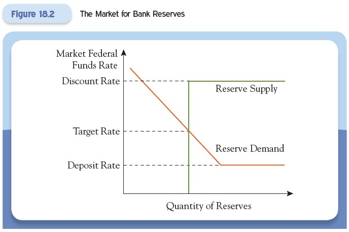
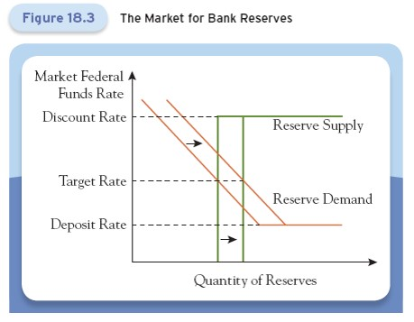
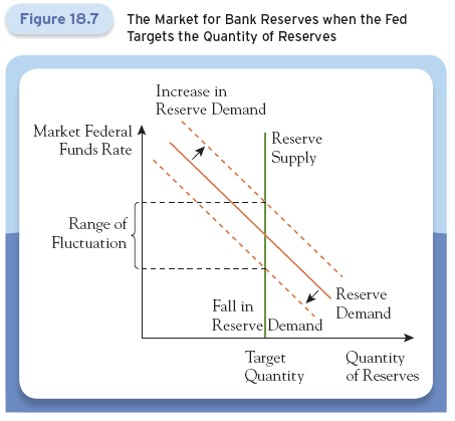
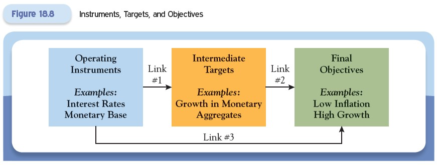

# Lecture 9: Monetary Policy: Stabilizing Domestic Economy

**Instructor:** Fei Tan

 @econdojo &nbsp;&nbsp;&nbsp;&nbsp;  @BusinessSchool101 &nbsp;&nbsp;&nbsp;&nbsp;  Saint Louis University

**Course:** Monetary Economics
**Date:** February 13, 2026

---

## Overview

This lecture studies three critical links in monetary policy:

1. Balance sheet to policy tools: How the central bank's balance sheet connects to its policy instruments
2. Tools to objectives: How policy tools relate to policymakers' goals
3. Monetary policy to real economy: How monetary policy affects economic activity

---

## The Road Ahead

1. [Federal Reserve's Conventional Policy](#federal-reserves-conventional-policy)
2. [Linking Tools to Objectives](#linking-tools-to-objectives)
3. [Taylor Rule](#taylor-rule)
4. [Unconventional Policy Tools](#unconventional-policy-tools)

---

## Federal Reserve's Conventional Policy

By buying or selling securities via open market operations, the Fed can control:
- The quantity of reserves that commercial banks hold
- The size of the monetary base
- The price of its components

Four conventional monetary policy tools:
1. Open market operations
2. Discount rate
3. Deposit rate
4. Reserve requirements

---

## Target vs. Market Federal Funds Rate

1. **Target federal funds rate:** Set by the Federal Open Market Committee (FOMC)
   - Policy decision by central bank
   - Announced publicly

2. **Market (or effective) federal funds rate:** Determined in the market
   - Interest rate at which banks borrow and lend reserves overnight
   - Fluctuates based on supply and demand

**Fed's objective:** Keep the effective rate close to the target rate through open market operations.

---

## Federal Funds Rate Corridor

The Fed allows the effective rate to fluctuate within a range:

**Upper bound:** **(Primary) discount rate**
- Interest rate Fed charges on loans to banks
- Banks won't borrow in market above this rate

**Lower bound:** **Deposit rate**
- Interest rate Fed pays on reserves held at the Fed
- Banks won't lend in market below this rate

**Target rate:** Set between these bounds

**Effective rate:** Determined by supply and demand for reserves within this corridor

---

## Supply and Demand for Reserves

- Demand curve: Banks demand more reserves when rate is lower

- Supply curve: Controlled by Fed through open market operations

- Equilibrium: Where supply equals demand, determining the effective rate

---

## Shifts in Supply and Demand Curves

When demand shifts or FOMC changes target, Fed uses open market operations to shift reserve supply, ensuring effective rate stays close to target rate.

---

## Discount Lending

Lending by the Fed to commercial banks.

**Key features:**
- Primary tool for ensuring short-term financial stability
- All loans are collateralized (Fed doesn't make uncollateralized loans)
- Fed serves as lender of last resort

**Three types of discount loans:**
1. Primary credit: To sound institutions on very short-term basis
2. Secondary credit: To institutions not qualifying for primary credit
3. Seasonal credit: Primarily to small agricultural banks

---

## Reserve Requirements

The reserve requirement is the level of balances a bank must hold either as vault cash or on deposit at the Fed.

$$m = \frac{C/D + 1}{C/D + r_D + ER/D}$$

An increase in required reserve ratio $r_D$ decreases the money multiplier $m$.

**Key insight:**
- Changes in reserve requirement affect the money multiplier
- Impacts quantity of money and credit in the economy
- Rarely changed due to disruptive effects

---

## Operational Policy at European Central Bank

**ECB's monetary toolbox:**
- Overnight interbank rate (equivalent to federal funds rate)
- Lending rate (equivalent to discount rate)
- Reserve deposit rate
- Reserve requirement

**Repurchase agreements (repo):**
- ECB purchases securities with agreement for seller to buy back later
- Provides collateralized loans to banking system
- Repo rate is the effective interest rate on these transactions

---

## Linking Tools to Objectives

Central bankers use various tools to meet policy objectives: low and stable inflation, high and stable growth, stable financial system, stable interest and exchange rates.

Features of a good policy instrument:

1. Easily observable by everyone—Transparency is crucial, market participants must understand policy stance

2. Controllable and quickly changed—Central bank must have direct control and can respond rapidly to changing conditions

3. Tightly linked to policymakers' objectives—Clear transmission mechanism and predictable effects on target variables

---

## Why Target Interest Rates?

Interest rates are the primary linkage between the financial system and the real economy. Stabilizing growth means keeping interest rates from being overly volatile. Targeting reserve quantities leads to excessive interest rate volatility.

---

## Operating Instruments vs. Intermediate Targets

- Operating instruments: Actual policy tools under direct central bank control (open market operations, discount rate, reserve requirements)

- Intermediate targets: Not under direct central bank control, lie between operating instruments and policy objectives (money supply, credit aggregates)

---

## Taylor Rule

A simple rule approximating how the FOMC sets the target federal funds rate:

$$\text{Target FFR} = 2 + \pi + 0.5 \times (\pi - \pi^*) + 0.5 \times \text{output gap}$$

where $\pi$ = current inflation rate, $\pi^*$ = inflation target, output gap = percentage deviation of current real GDP from potential

**Key components:**

1. Long-term real interest rate: Assumed to be 2%
2. Current inflation: Direct pass-through to nominal rate
3. Inflation gap $(\pi - \pi^*)$: Current inflation minus target, weight of 0.5
4. Output gap: Deviation of GDP from potential, weight of 0.5

---

## Taylor Rule Policy Responses

**When inflation rises above target:**
- Affects two terms: current inflation AND inflation gap
- Results in more than one-for-one increase in target rate
- Raises real interest rate
- Slows economy and reduces inflation

**When output falls below potential:**
- Response is to lower interest rates
- Stimulates economic activity
- Helps close output gap

**Key insight:** The rule builds in stabilization responses (leaning against the wind).

---

## Monetary Policy Shocks

The effective federal funds rate can deviate from what the Taylor rule predicts:

$$\text{Effective FFR} = \text{Target FFR} + \text{monetary policy shock}$$

**Monetary policy shock:**
- Random component not captured by inflation or output gap
- Represents discretionary policy decisions
- Can be measured as residual from Taylor rule

---

## Unconventional Policy Tools

| Tool | Mechanism | Primary Goal |
|------|-----------|--------------|
| Forward Guidance | Expectations management | Lower long rates via commitment |
| Quantitative Easing | Balance sheet expansion | Lower rates via quantity |
| Targeted Asset Purchases | Asset mix changes | Lower specific market rates |

When are they needed?

1. Zero lower bound: When lowering target rate to zero is insufficient to stimulate economy

2. Impaired financial system: When conventional interest-rate policy cannot support economic growth
